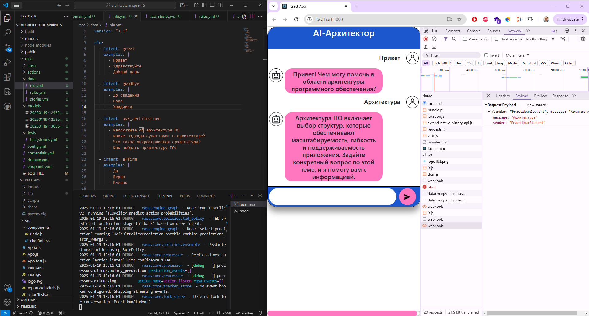

# Спринт 5
Yandex practicum course: software architect - sprint 5

## Задание

Ваша задача — разработать и интегрировать интеллектуального ассистента в веб-приложение. Проект выходит за рамки простого создания чат-бота и включает полную цепочку разработки и развёртывания решения в продакшн-среду.
Вы начнёте с загрузки готового веб-приложения из репозитория, представляющего собой основу вашего проекта. Это приложение уже готово к работе с внешними сервисами, и вам нужно расширить его возможности, интегрировав в него интеллектуального ассистента.
В качестве платформы для создания и настройки ассистента вы будете использовать Rasa (платформа для построения диалоговых систем, чат-ботов и AI-ассистенотов). За счёт подключения LLM модели вы сделаете ассистента умным.
После того как ассистент будет настроен и запущен, вы интегрируете его с React-приложением через API. Основное внимание будет уделено работе ассистента с текстовыми запросами, распознаванию намерений и предоставлению персонализированных ответов на основе обученной модели. 

### 1. Веб приложение
- npm install
- npm run build
- npm start

Результатом этого шага должно быть запущенное приложение ассистента в браузере.

### 2. Установка и настройка окружения
    
Python (3.7-3.10): Rasa работает с версиями Python 3.7 и выше, но ниже 3.11.
pip — менеджер пакетов Python, который будет использоваться для установки Rasa.
Virtualenv (рекомендуется): использование виртуальной среды для изоляции окружения и зависимостей проекта.

- Убедитесь, что pip установлен. Выполните команду:
    - python -m ensurepip --upgrade

- Установите virtualenv, если он ещё не установлен:
    - pip install virtualenv

- Создайте виртуальное окружение:
    - python -m venv rasa_env

- Активируйте виртуальное окружение:
    - source rasa_env/bin/activate

### 3. Установка Rasa

- pip install rasa

- Установите библиотеку Transformers для работы с предобученными LLM моделями, такими как BERT, GPT:
    - pip install transformers

- Проверьте, что Rasa и окружение установлено, выполните команду:
    - rasa --version

### 4. Настройка Rasa и подключение модели

После установки Rasa инициализируйте новый проект Rasa, который создаст структуру вашего проекта:
- rasa init

### 5. Адаптация модели и платформы под русский язык

Для обработки русского языка и использования предобученных моделей, таких как BERT, нужно правильно настроить пайплайн в config.yml. Мы используем модель BERT из ранее установленного пакета transformers.

Мы подготовили конфигурационные файлы и сценарии. Вы можете загрузить их или создать свои.
Замените настроенные конфигурации в соответствующих директориях:
- config.yaml
- stories.yml
- rules.yml
- nlu.yml
- domain.yml

Выполните тренировку модели на новой конфигурации:

- rasa train 
- rasa run --enable-api --cors "*" --log-file LOG_FILE

### Результаты

- [Логи бота](./rasa/LOG_FILE_2)

